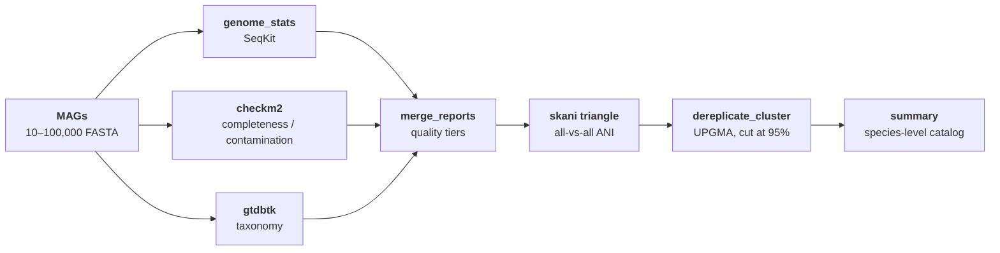

<div align="center">

# meta-pipeline-MAGDrep

**Quality assessment, taxonomic classification, and species-level dereplication of metagenome-assembled genomes — at scale.**

[](https://www.python.org)
[](https://snakemake.readthedocs.io/)
[](LICENSE)
[]()
[]()

</div>

---

## What it does

Take a directory of MAGs, get back a clean species-level catalog with taxonomy, quality metrics, and per-cluster representatives.



---

## Quick start

```bash
# 1. Clone + install (creates magdrep conda env with all tools)
git clone https://github.com/SDmetagenomics/meta-pipeline-MAGDrep.git
cd meta-pipeline-MAGDrep
make install
conda activate magdrep

# 2. Download reference databases (~88 GB total, one-time)
meta-pipeline-MAGDrep db update
meta-pipeline-MAGDrep db status      # should read "All databases ready"

# 3. Run the pipeline
meta-pipeline-MAGDrep qc -i mags/ -o results/
```

Need more detail? See the [**Program Guide**](docs/program-guide.md) for rationale, installation, functionality, runtime, and use-case walkthroughs.

---

## Pipeline steps

| Step | Tool | What | Database |
|---|---|---|---|
| `genome_stats` | SeqKit 2.13 | Length, GC, N50, contig count | — |
| `checkm2` | CheckM2 1.1.0 | Completeness + contamination (neural net) | CheckM2 diamond DB (~3 GB) |
| `gtdbtk` | GTDB-Tk 2.5.2 | Taxonomy — GTDB release 226 | GTDB-Tk r226 (~85 GB) |
| `dereplicate` | skani 0.3.1 + scipy | Species clustering (UPGMA at 95% ANI) | — |

Each step is batched so memory stays bounded on 10k+ genome datasets. CheckM2 and GTDB-Tk run **concurrently** by default and can be routed to different SLURM partitions.

---

## Output layout

```
results/
├── summary_report.tsv          # compact: stats + quality + taxonomy, one row per MAG
├── combined_report.tsv         # full: every column from every tool
├── filtered_report.tsv         # quality-filtered subset
├── genome_stats/<mag>/genome_stats.tsv
├── checkm2/
│   ├── checkm2_quality.tsv     # merged CheckM2 output
│   └── batches/<batch>/raw/    # full CheckM2 run: protein_files/, diamond/, quality_report.tsv
├── gtdbtk/
│   ├── gtdbtk_taxonomy.tsv     # merged, with parsed lineage columns
│   └── batches/<batch>/raw/    # full GTDB-Tk run: identify/, align/, classify/
├── dereplicate/
│   ├── skani_edges.tsv
│   ├── species_clusters.tsv    # every MAG → its cluster + representative
│   └── dereplicated_report.tsv # one row per species
└── benchmarks/                 # per-rule timing for tuning
```

---

## Putting databases anywhere you want

By default, databases live in `databases/` inside the project. To point at a
shared lab location instead, set the `MAGDREP_DB_DIR` environment variable:

```bash
# One-time: set in your shell profile
export MAGDREP_DB_DIR=/shared/lab/meta-pipeline-MAGDrep-db

# Now every command finds them automatically
meta-pipeline-MAGDrep db update     # downloads to $MAGDREP_DB_DIR
meta-pipeline-MAGDrep db status     # checks $MAGDREP_DB_DIR
meta-pipeline-MAGDrep qc -i mags/ -o results/   # uses $MAGDREP_DB_DIR
```

Resolution order: `--db-dir` flag > `$MAGDREP_DB_DIR` > project `databases/`.

---

## CLI reference

### `meta-pipeline-MAGDrep`

```
Usage: meta-pipeline-MAGDrep [OPTIONS] COMMAND [ARGS]...

  meta-pipeline-MAGDrep: quality assessment and taxonomy of MAGs at scale.

Options:
  --version  Show the version and exit.
  --help     Show this message and exit.

Commands:
  benchmark  Summarize step timing from a completed pipeline run.
  db         Manage reference databases.
  qc         Run quality assessment on a directory of MAG FASTA files.
```

### `qc` — run the pipeline

```
Usage: meta-pipeline-MAGDrep qc [OPTIONS]

Options:
  -i, --input DIRECTORY           Directory of input MAG FASTA files.  [required]
  -o, --output PATH               Output directory.  [required]
  --profile [gcp|local|slurm]     Execution profile.  [default: local]
  --steps TEXT                    Comma-separated steps to run (e.g. checkm2,gtdbtk). Default: all.
  --skip TEXT                     Comma-separated steps to skip (e.g. gtdbtk).
  --config PATH                   Path to a custom config YAML.
  --dry-run                       Show what would be run without executing.
  -j, --jobs INTEGER              Maximum parallel jobs. Overrides config.
  --cluster-cpus INTEGER          CPUs per standard compute node for SLURM/GCP.
                                  Auto-detected from sinfo if not set.
  --cluster-mem-gb INTEGER        Memory (GB) per standard compute node.
                                  Auto-detected from sinfo if not set.
  --cluster-mem-node-cpus INTEGER CPUs on memory-partition nodes (for GTDB-Tk).
                                  Defaults to --cluster-cpus.
  --cluster-mem-node-mem-gb INTEGER
                                  Memory (GB) on memory-partition nodes.
                                  Defaults to --cluster-mem-gb.
  --slurm-standard-partition TEXT SLURM partition for CheckM2 and most rules.  [default: normal]
  --slurm-memory-partition TEXT   SLURM partition for GTDB-Tk (high-memory).
                                  Defaults to --slurm-standard-partition.
  --help                          Show this message and exit.
```

### `db update` — download reference databases

```
Usage: meta-pipeline-MAGDrep db update [OPTIONS]

Options:
  --db-dir PATH  Directory to download databases into.
                 Defaults to $MAGDREP_DB_DIR env var or ./databases/.
  --only TEXT    Download only this database (checkm2 or gtdbtk).
  --force        Re-download even if already present.
  --help         Show this message and exit.
```

### `db status` — check what's installed

```
Usage: meta-pipeline-MAGDrep db status [OPTIONS]

Options:
  --db-dir PATH  Database directory to inspect.
                 Defaults to $MAGDREP_DB_DIR env var or ./databases/.
  --help         Show this message and exit.
```

### `benchmark` — summarize step timing

```
Usage: meta-pipeline-MAGDrep benchmark [OPTIONS] RESULTS_DIR

  Summarize step timing from a completed pipeline run.
```

### Common patterns

```bash
# Run with a custom config
meta-pipeline-MAGDrep qc -i mags/ -o results/ --config my-config.yaml

# Skip the taxonomy step (fast dev iteration)
meta-pipeline-MAGDrep qc -i mags/ -o results/ --skip gtdbtk

# HPC with separate standard + memory partitions
meta-pipeline-MAGDrep qc -i mags/ -o results/ --profile slurm \
    --slurm-standard-partition standard --slurm-memory-partition memory

# GCP (see docs/deployment/gcp.md for setup)
meta-pipeline-MAGDrep qc -i gs://bucket/mags/ -o gs://bucket/results/ --profile gcp

# Check how long each step took
meta-pipeline-MAGDrep benchmark results/

# Inspect which databases are installed
meta-pipeline-MAGDrep db status
```

---

## Quality tiers

| Tier | Completeness | Contamination | Quality score = comp − 5·contam |
|---|---|---|---|
| `high_quality` | ≥ 90% | < 5% | ≥ 50 |
| `medium_quality` | ≥ 60% | < 10% | ≥ 50 |
| `low_quality` | < 60% OR ≥ 10% OR < 50 | — | — |

The dereplication step operates on `filtered_report.tsv` — by default, `high_quality` + `medium_quality` genomes.

---

## Dereplication algorithm

1. **skani triangle** — all-vs-all ANI with bi-directional alignment-fraction filter (≥ 10% both directions).
2. **Connected components at 90% ANI** — partitions the similarity graph so each component's distance matrix stays small. Scales to 100k+ genomes.
3. **Average-linkage hierarchical clustering** within each component (UPGMA on ANI distance).
4. **Cut at 95% ANI** → species-level clusters.
5. **Representative selection** — highest composite quality score per cluster (weighted qscore, completeness, log₁₀(N50), 100 − contamination).

---

## Deployment

| Where | Profile | Docs |
|---|---|---|
| Laptop / workstation | `--profile local` (default) | [Program Guide](docs/program-guide.md) |
| HPC / SLURM | `--profile slurm` | [docs/deployment/slurm.md](docs/deployment/slurm.md) |
| Google Cloud (Batch) | `--profile gcp` | [docs/deployment/gcp.md](docs/deployment/gcp.md) |

---

## Citing

If you use this pipeline, please cite the component tools:

- **CheckM2** — Chklovski A, Parks DH, Woodcroft BJ, Tyson GW (2023) *Nat Methods* 20:1203–1212.
- **GTDB-Tk** — Chaumeil P-A, Mussig AJ, Hugenholtz P, Parks DH (2022) *Bioinformatics* 38:5315–5316.
- **GTDB r226** — Parks DH, et al. (2026) *Nucleic Acids Res* 54:D743–D754.
- **skani** — Shaw J, Yu YW (2023) *Nat Methods* 20:1633–1634.
- **SeqKit** — Shen W, Le S, Li Y, Hu F (2016) *PLoS ONE* 11:e0163962.
- **Snakemake** — Köster J, Rahmann S (2012) *Bioinformatics* 28:2520–2522.

---

<div align="center">

Made by the [Diamond Lab](https://diamondlab.com) · [Issues](https://github.com/SDmetagenomics/meta-pipeline-MAGDrep/issues) · [Program Guide](docs/program-guide.md)

</div>
