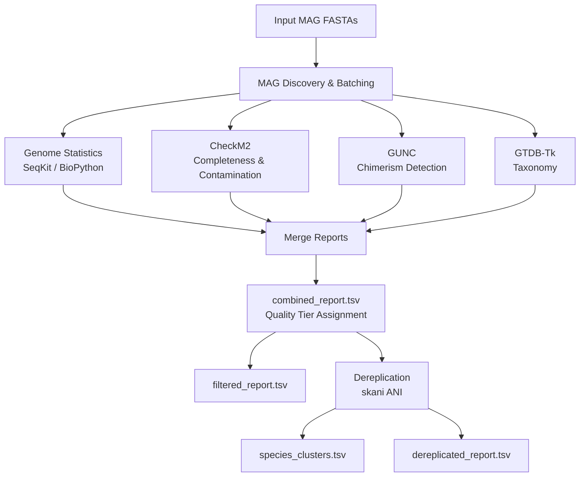

# Pipeline Architecture

## Data Flow



## Execution Model

The pipeline is orchestrated by Snakemake. Each step is defined as a set of rules in `rules/`. Steps run in parallel where data dependencies allow:

- **Genome statistics**, **CheckM2**, **GUNC**, and **GTDB-Tk** run independently in parallel.
- **Merge reports** waits for all four to complete.
- **Dereplication** runs after the merge, using quality scores to select representatives.

## Batching

Large input sets are split into batches of configurable size (default: 1,000 genomes). Each batch is processed as an independent Snakemake job. This bounds peak memory and allows partial results to appear early.

## Execution Profiles

| Profile | Description |
|---------|-------------|
| `local` | Runs on the current machine using Snakemake's Python API. |
| `slurm` | Submits jobs to a SLURM cluster using `snakemake-executor-plugin-slurm`. |

Profiles are stored in `config/profiles/` and set resource defaults (threads, memory, time limits) per rule.

## Step Selection

Steps can be included or excluded at the command line:

```bash
# Run only genome stats and CheckM2
meta-pipeline-MAGDrep run -i mags/ -o results/ --steps genome_stats,checkm2

# Run everything except GTDB-Tk
meta-pipeline-MAGDrep run -i mags/ -o results/ --skip gtdbtk
```

When a step is skipped, its columns are absent from the combined report and quality tiers that depend on those columns are marked as `NA`.
