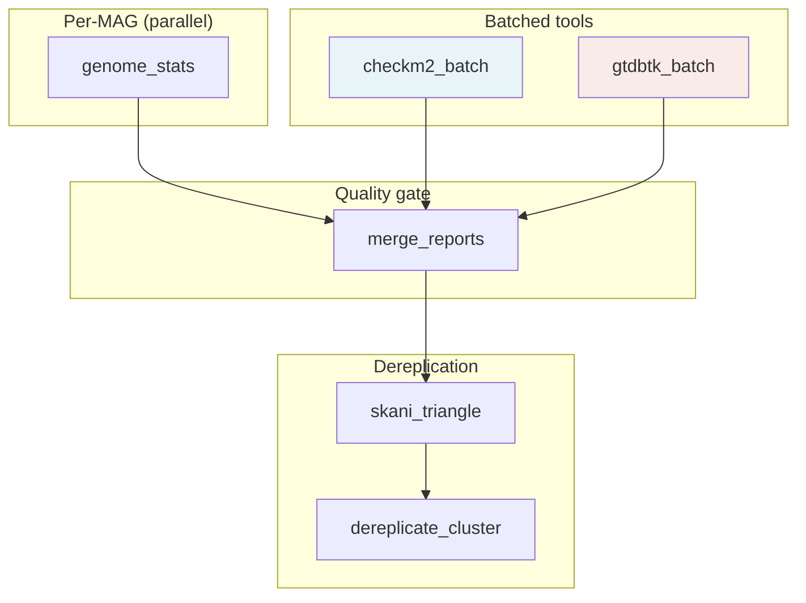

# meta-pipeline-MAGDrep — Program Guide

A complete reference for installing, configuring, running, and tuning
MAGDrep. If you want the one-page overview, start at the
[README](../README.md). This guide goes deeper.

---

## Table of contents

1. [Rationale](#1-rationale)
2. [Installation](#2-installation)
3. [Databases](#3-databases)
4. [How the pipeline works](#4-how-the-pipeline-works)
5. [Configuration](#5-configuration)
6. [Outputs](#6-outputs)
7. [Runtime and resource constraints](#7-runtime-and-resource-constraints)
8. [Use cases](#8-use-cases)
9. [Troubleshooting](#9-troubleshooting)
10. [FAQ](#10-faq)

---

## 1. Rationale

### The problem

Modern metagenomics projects routinely produce tens of thousands of
metagenome-assembled genomes (MAGs). Before those MAGs are useful for
downstream analysis — comparative genomics, pangenome studies, strain
tracking, functional annotation — they have to be:

1. **Quality-filtered.** Low-completeness or contaminated bins are worse
   than no bin at all: they corrupt phylogenies and inflate gene counts.
2. **Taxonomically classified.** Without taxonomy, MAGs are just anonymous
   sequence. Genus/species placement is the minimum bar for interpretation.
3. **Dereplicated to species level.** When the same organism is
   assembled from ten different samples you get ten near-identical MAGs.
   Most downstream tools assume one representative per species.

These three steps are individually well-solved — CheckM2, GTDB-Tk, and
skani are best-in-class. The hard part is running them together,
correctly, at scale, reproducibly, with sensible defaults, across a
laptop, a SLURM cluster, and a cloud VM pool.

### Design goals

- **Reproducibility over cleverness.** Exact tool versions pinned in
  `environment.yml`, conda-lock.txt generated at build time, database
  versions declared in config.
- **Sensible defaults, accessible knobs.** A fresh user runs
  `make install && meta-pipeline-MAGDrep qc -i mags/ -o results/`. An
  expert tunes every threshold, thread count, and batch size.
- **Resource awareness.** The pipeline detects CPUs and memory, splits
  work so CheckM2 and GTDB-Tk run concurrently when possible, and sizes
  pplacer threads based on available RAM.
- **Scales from 10 to 100,000 MAGs.** Batched tool invocations keep
  memory bounded; connected-component pre-clustering keeps skani
  triangle tractable.
- **Human-readable outputs.** Every tool's raw output lives in its own
  folder. The top-level is three clear TSVs: summary, combined,
  filtered.

### What MAGDrep is not

- Not an assembler or binner. Start with MAGs you've already produced
  (e.g. via MetaBAT2, CONCOCT, or VAMB).
- Not a functional annotator. Pair with sister tool
  [ORFanno](https://github.com/SDmetagenomics/meta-pipeline-ORFanno) for
  gene calling and function.
- Not a viral / eukaryotic tool. Targets bacteria and archaea; GTDB-Tk
  will not classify viruses or eukaryotes.

---

## 2. Installation

### Requirements

- **OS**: Linux (x86_64) or macOS (arm64 or x86_64). Windows via WSL2.
- **mamba** or **conda** — the install uses `mamba` under the hood for speed.
- **~250 GB of disk space** — mostly for the GTDB-Tk database.
- **Minimum RAM**: 64 GB (pplacer alone needs ~60 GB for r226).
  Recommended: 128 GB+.

### One-command install

```bash
git clone https://github.com/SDmetagenomics/meta-pipeline-MAGDrep.git
cd meta-pipeline-MAGDrep
make install
conda activate magdrep
```

`make install` creates a conda environment called `magdrep` from
`environment.yml` (exact versions pinned) and installs this package in
editable mode. `conda-lock.txt` is included for fully reproducible
recreation of the environment across machines.

### Verify the install

```bash
meta-pipeline-MAGDrep --version
make test                 # should report 58 passed
```

### Uninstall

```bash
conda env remove -n magdrep
```

### Running inside a container

A `Dockerfile` is provided for cloud / containerized use. See
[docs/deployment/gcp.md](deployment/gcp.md) for building and pushing
to a registry.

---

## 3. Databases

MAGDrep uses two external databases, ~88 GB combined:

| Database | Size | Purpose | Updates |
|---|---|---|---|
| **CheckM2** | ~3 GB | Neural-net model + diamond reference for completeness/contamination | Tied to CheckM2 version |
| **GTDB-Tk r226** | ~85 GB | Reference genomes + pplacer trees for GTDB taxonomy (release 226) | Annual new release |

### Download

```bash
meta-pipeline-MAGDrep db update
```

This runs the tools' own download routines and drops results under
`databases/`, creating a sentinel file (`*.ok`) on completion so re-runs
are instant. Download takes 30 min to several hours depending on
network — GTDB-Tk is the bottleneck.

Target a specific database:

```bash
meta-pipeline-MAGDrep db update --only checkm2
```

Force re-download:

```bash
meta-pipeline-MAGDrep db update --force
```

### Check status

```bash
$ meta-pipeline-MAGDrep db status
Database directory: /path/to/meta-pipeline-MAGDrep/databases

  [     OK]  CheckM2               ~3 GB
  [     OK]  GTDB-Tk (r226)        ~85 GB

All databases ready.
```

### Using a shared lab database directory

Point `db_dir` at a shared filesystem in your config:

```yaml
# my-config.yaml
db_dir: /shared/lab/databases
```

Then:

```bash
meta-pipeline-MAGDrep qc -i mags/ -o results/ --config my-config.yaml
```

Or set individual paths:

```yaml
checkm2_db_path: /shared/lab/databases/checkm2
gtdbtk_db_path:  /shared/lab/databases/gtdbtk
```

### Database versions

The pinned versions are declared in `config/config.yaml` under
`db_versions` — update that when you refresh databases so the version
appears in run logs.

---

## 4. How the pipeline works



### Step 1 — genome_stats

Per MAG, one job. Runs `seqkit fx2tab` plus a Python helper to compute
length, GC%, N50, contig count, largest contig. Output:
`results/genome_stats/<mag>/genome_stats.tsv`.

Fast — milliseconds per MAG. Snakemake's `group:` directive bundles
many of these into a single SLURM job so the scheduler isn't overwhelmed.

### Step 2 — checkm2_batch

MAGs are grouped into batches of `checkm2_batch_size` (default 1000)
and each batch runs `checkm2 predict` in parallel across `{threads}`
threads. CheckM2 uses a diamond search against a curated reference set
plus a neural-network model to estimate completeness and contamination.

Memory per batch: ~4–5 GB (diamond index) + a few hundred MB per thread.

### Step 3 — gtdbtk_batch

Per batch of `gtdbtk_batch_size` genomes (default 1000), runs
`gtdbtk classify_wf`. Internally this is:

1. **identify** — Prodigal gene calling + HMM search for 120 bacterial /
   53 archaeal marker genes.
2. **align** — multiple alignment of markers to GTDB reference.
3. **classify** — phylogenetic placement via pplacer + ANI screening
   via FastANI against candidate species representatives.

Memory per pplacer process: ~60 GB for the r226 bac120 tree. MAGDrep
auto-scales `pplacer_cpus` based on available RAM.

**Heads-up for test data**: GTDB-Tk aborts if any input genome's
filename matches a reference accession. MAGDrep's `gtdbtk_setup_batch`
rule prefixes all symlinks with `MAG_` and strips the prefix when
parsing output — so test runs against real NCBI genomes work fine.

### Step 4 — merge_reports

Left-joins the three per-MAG tables on `mag_id`, computes quality tiers,
writes `combined_report.tsv`, `filtered_report.tsv`, and
`summary_report.tsv`.

### Step 5 — skani_triangle

Reads `filtered_report.tsv`, collects the corresponding FASTA paths,
runs `skani triangle -E --min-af 10` for all-vs-all ANI. Produces a
sparse edge list — only pairs where both alignment fractions exceed 10%
and ANI is detectable (typically ≥ 80%).

Fast — skani is orders of magnitude faster than FastANI for pairwise
comparisons. 50k genomes in ~1 h on a 32-core node.

### Step 6 — dereplicate_cluster

This is where MAGDrep does something novel. The naive approach —
hierarchical clustering on a dense N×N ANI matrix — blows up at 10k+
genomes. The fix:

1. **Connected components at 90% ANI.** BFS over the AF-filtered edge
   graph. Two genomes are in the same component if there's a chain of
   ≥ 90% ANI connections between them (AF-filtered in both directions).
2. **Per-component average linkage (UPGMA).** For each component, build
   a dense distance matrix (100 − ANI), run
   `scipy.cluster.hierarchy.linkage(method="average")`.
3. **Cut at distance = 5.0** (= 95% ANI) to define species-level
   clusters.
4. **Representative per cluster** = highest composite quality score
   (weighted qscore, completeness, log₁₀(N50), 100 − contamination).

Why average linkage instead of greedy? Greedy clustering's merge
decision depends only on the ANI to the current representative.
Average linkage uses mean ANI across all existing members — more
principled, and importantly, order-independent. The test suite has a
case that proves these give different answers on asymmetric triplets.

Why connected components first? At 90% ANI, any two genomes in
different components are guaranteed to have < 90% ANI, so they can
*never* be in the same 95% cluster. Clustering each component
independently gives the same answer as clustering the whole dataset,
but with distance matrices that stay small (typically < 50×50 even on
100k-genome runs).

### Resource allocation in detail

On a single machine with N CPUs and M GB RAM:

- `threads_per_job` = min(N, 8) — for tools like SeqKit.
- `checkm2_threads` = N/2 — split with GTDB-Tk for concurrent scheduling.
- `gtdbtk.threads` = N/2 — same.
- `pplacer_cpus` = max(1, (M − 8 GB overhead − 8 GB CheckM2) / 60 GB).

On SLURM with separate standard + memory partitions:

- CheckM2 = all CPUs of a standard node — no contention with GTDB-Tk.
- GTDB-Tk = all CPUs of a memory node.
- `pplacer_cpus` = memory node RAM / 60 GB.

---

## 5. Configuration

### Config sources (later wins)

1. `config/config.yaml` — ships with the package, sensible defaults.
2. `--config path/to/my.yaml` — user file, merges over defaults.
3. CLI flags (`--cluster-cpus`, `--slurm-memory-partition`, …).

### Key knobs

```yaml
# Batching
batch_size: 1000                    # global default
checkm2_batch_size: null            # override per tool (null = use batch_size)
gtdbtk_batch_size: null

# Threads (auto by default)
checkm2_threads: auto
gtdbtk:
  threads: auto
  pplacer_cpus: auto
  skip_ani_screen: false

# Databases
db_dir: databases
checkm2_db_path: null               # null = db_dir/checkm2
gtdbtk_db_path: null

# Quality filter
quality_filter:
  high_completeness: 90.0
  high_contamination: 5.0
  medium_completeness: 60.0
  medium_contamination: 10.0
  min_quality_score: 50.0
  default_filter: medium_quality    # or high_quality

# Dereplication
dereplicate:
  ani_threshold: 95.0               # species cutoff
  min_af: 10.0                      # bi-directional alignment fraction
  score_weights:
    w_qscore: 1.0
    w_completeness: 1.0
    w_n50: 0.5
    w_contam: 0.5
```

### Steps to run

Default is all four. Skip one:

```bash
meta-pipeline-MAGDrep qc -i mags/ -o results/ --skip gtdbtk
```

Run only specific ones:

```bash
meta-pipeline-MAGDrep qc -i mags/ -o results/ --steps genome_stats,checkm2
```

---

## 6. Outputs

### Top-level reports (most users stop here)

**`summary_report.tsv`** — the compact one: stats + quality + taxonomy,
one row per MAG. Columns: `mag_id`, length/GC/N50/contigs, completeness,
contamination, quality_score, quality_tier, domain → species,
classification (full GTDB string).

**`combined_report.tsv`** — every column from every tool. Useful if you
need FastANI values, CheckM2 model details, etc.

**`filtered_report.tsv`** — same columns as combined, filtered to
genomes passing the quality tier threshold.

**`dereplicate/dereplicated_report.tsv`** — one row per species (the
representative genome). Same columns as filtered plus `cluster_id`,
`cluster_size`, `composite_score`.

**`dereplicate/species_clusters.tsv`** — full membership table: every
MAG → its cluster → its representative.

### Per-tool rich outputs

**`checkm2/batches/<batch>/raw/`** — CheckM2's native output:
protein FASTAs per genome, diamond hit tables, quality report.

**`gtdbtk/batches/<batch>/raw/`** — GTDB-Tk's native output:
identify/ (marker genes), align/ (multiple alignment),
classify/ (bac120 + ar53 summary files, per-genome classification notes).

**`genome_stats/<mag>/genome_stats.tsv`** — per-genome stats (also
concatenated into the top-level reports).

### Benchmarks

**`benchmarks/<rule>/<batch>.tsv`** — Snakemake-captured wall time, CPU
time, max RSS, I/O per job. View with:

```bash
meta-pipeline-MAGDrep benchmark results/
```

---

## 7. Runtime and resource constraints

### Single-machine runtime (empirical)

On a 16-CPU / 128 GB laptop running 50 NCBI bacterial genomes (full
pipeline, concurrent CheckM2 + GTDB-Tk):

| Step | Wall time |
|---|---|
| genome_stats | 3 s |
| checkm2 | 6 min |
| gtdbtk | 13 min |
| skani_triangle + dereplicate | < 1 s |
| **End-to-end** | **~13 min** |

Before concurrency was enabled, the same run took 45 min sequentially —
a 3.5× speedup from CPU-budget-aware scheduling.

### Scaling — rough guidance

| Dataset | Hardware | Wall time (approx) |
|---|---|---|
| 50 MAGs | 16 CPU / 128 GB | 15 min |
| 500 MAGs | 32 CPU / 256 GB | 2 h |
| 5,000 MAGs | HPC, 5 × 64-CPU nodes | 8 h |
| 50,000 MAGs | HPC, 50 × 64-CPU nodes | 16 h |

The dominant factor is always GTDB-Tk's pplacer step. CheckM2 parallelizes
cheaply; dereplication is fast even on 100k genomes because of the
connected-component pre-clustering.

### Memory

- **CheckM2** — ~5 GB per thread (diamond index dominates).
- **GTDB-Tk** — ~60 GB **per pplacer process** (bac120 tree is the cost).
  Everything else (identify, align, FastANI) is modest.
- **skani triangle** — ~1 GB per 10k genomes.
- **Pipeline orchestration** — < 1 GB.

### Disk

- **Databases** — 88 GB.
- **Intermediate** — roughly 2× the total input FASTA size (protein
  files, diamond output, GTDB-Tk alignments). Cleaned up on completion
  if you run `snakemake --delete-temp-output`.
- **Final outputs** — small (< 10 MB even for 50k genomes).

Set `tmpdir:` in the SLURM profile to node-local SSD for big speedups
on shared-filesystem clusters.

---

## 8. Use cases

### Use case 1 — "I have 200 MAGs from a single metagenome"

```bash
meta-pipeline-MAGDrep qc -i mags/ -o results/
meta-pipeline-MAGDrep benchmark results/
```

Total runtime on a laptop: ~1 h. Look at `summary_report.tsv` for the
per-genome answer, `dereplicate/dereplicated_report.tsv` for the
species-level catalog.

### Use case 2 — "I have 10,000 MAGs and access to SLURM"

```bash
meta-pipeline-MAGDrep qc -i /scratch/mags/ -o /scratch/results/ \
    --profile slurm \
    --slurm-standard-partition standard \
    --slurm-memory-partition memory \
    --config checkm2_batch_size=200 gtdbtk_batch_size=1000
```

See [docs/deployment/slurm.md](deployment/slurm.md) for profile tuning.

### Use case 3 — "Quality control only, no taxonomy"

```bash
meta-pipeline-MAGDrep qc -i mags/ -o results/ --skip gtdbtk --skip dereplicate
```

Skips the two expensive steps. Produces `summary_report.tsv` with
genome stats + CheckM2 metrics but no taxonomy columns.

### Use case 4 — "Re-run with stricter quality filter"

```bash
# my-strict.yaml
quality_filter:
  default_filter: high_quality     # instead of medium_quality
```

```bash
meta-pipeline-MAGDrep qc -i mags/ -o results/ --config my-strict.yaml
```

Dereplication now operates only on high-quality genomes.

### Use case 5 — "Cloud burst for one-off large runs"

See [docs/deployment/gcp.md](deployment/gcp.md). Requires a GCP
project, a container image, and a GCS bucket. ~$175 for 10k MAGs
end-to-end (rough 2026 pricing).

### Use case 6 — "Lab-shared databases, per-user runs"

Drop databases on a shared filesystem once, have each user's config
point at them:

```yaml
db_dir: /lab/shared/magdrep-dbs
```

Sentinel files in the shared directory prevent accidental re-downloads.

### Use case 7 — "Incremental updates (new MAGs on top of an old run)"

Snakemake caches per-rule output. Add new MAGs to your input dir and
re-run: only the new batches (and the downstream aggregation and
dereplication) will execute.

---

## 9. Troubleshooting

### GTDB-Tk hard exit: "X genomes with the same id as GTDB-Tk reference"

This shouldn't happen on real MAGs but does on test datasets of real
NCBI genomes. MAGDrep handles it automatically via the `MAG_` prefix
trick — if you see this with real MAGs, check that your filenames
haven't been renamed to GTDB accession format.

### CheckM2 AttributeError on private `__set_up_prodigal_thread`

Python 3.12 spawn multiprocessing incompatibility. MAGDrep wraps
checkm2 to force `fork` mode — if you see this, make sure you're on
the current magdrep env.

### Snakemake "LockException"

A previous run was killed mid-execution. Remove:

```bash
rm -rf .snakemake/locks
```

### pplacer OOM (killed mid-classify)

Memory per pplacer process exceeded available RAM. Reduce:

```bash
meta-pipeline-MAGDrep qc ... --config gtdbtk.pplacer_cpus=1
```

Or run GTDB-Tk on a memory partition (see SLURM deployment docs).

### "No FASTA files found in input directory"

Input dir must contain `.fna`, `.fa`, `.fasta` (optionally gzipped).
Check permissions and that files aren't symlinks to non-existent paths.

### Downloads fail with read timeout

NCBI / GTDB servers occasionally time out on slow connections. Re-run
`db update` — the download resumes via the tool's own retry logic (and
sentinel files prevent duplicate work).

---

## 10. FAQ

**Q: Does it support viral or eukaryotic genomes?**
No. GTDB-Tk is bacteria + archaea only, and CheckM2's model is trained
on prokaryotes. For viruses, use CheckV + geNomad; for eukaryotes,
EukCC + BUSCO.

**Q: Can I run only GTDB-Tk without dereplication?**
Yes: `--steps gtdbtk` (genome_stats still runs, since quality is needed
for GTDB-Tk batching).

**Q: How do I compare two MAGs I already know are close?**
Run `skani dist genome_A.fna genome_B.fna` directly. MAGDrep wraps
`skani triangle` which is for all-vs-all.

**Q: Can I customize the representative-selection weights?**
Yes, under `dereplicate.score_weights` in config. Weights are
multiplicative coefficients on min-max-normalized metrics.

**Q: How often should I update databases?**
GTDB releases roughly annually. CheckM2 database updates are less
frequent. Update via `meta-pipeline-MAGDrep db update --force`.

**Q: What's the minimum completeness to be useful?**
Depends on your downstream use. 50% is the MIMAG minimum for "medium
quality"; 90% for "high quality" / "near-complete". GTDB-Tk classifies
reliably down to ~50% completeness; below that, classification becomes
unreliable.

**Q: Are the output TSVs stable across versions?**
Column set is semi-stable pre-1.0. Post-1.0 we commit to SemVer: new
columns append, existing columns don't change type or meaning without
a major version bump.

---

## See also

- [README](../README.md) — one-page overview
- [docs/deployment/slurm.md](deployment/slurm.md) — SLURM deployment
- [docs/deployment/gcp.md](deployment/gcp.md) — Google Cloud deployment
- [CLAUDE.md](../CLAUDE.md) — developer-facing project state
- [MkDocs site](index.md) — renders this content with navigation
