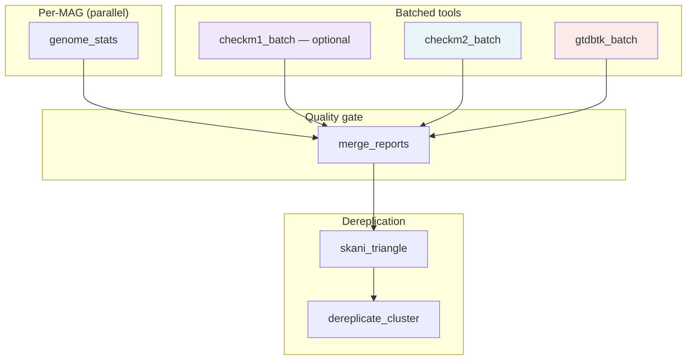

# meta-pipeline-MAGDrep — Program Guide

A complete reference for installing, configuring, running, and tuning
MAGDrep. If you want the one-page overview, start at the
[README](../README.md). This guide goes deeper.

---

## Table of contents

1. [Rationale](#1-rationale)
2. [Installation](#2-installation)
3. [Databases](#3-databases)
4. [How the pipeline works](#4-how-the-pipeline-works)
5. [Configuration](#5-configuration)
6. [Outputs](#6-outputs)
7. [Runtime and resource constraints](#7-runtime-and-resource-constraints)
8. [Use cases](#8-use-cases)
9. [Troubleshooting](#9-troubleshooting)
10. [FAQ](#10-faq)

---

## 1. Rationale

### The problem

Modern metagenomics projects routinely produce tens of thousands of
metagenome-assembled genomes (MAGs). Before those MAGs are useful for
downstream analysis — comparative genomics, pangenome studies, strain
tracking, functional annotation — they have to be:

1. **Quality-filtered.** Low-completeness or contaminated bins are worse
   than no bin at all: they corrupt phylogenies and inflate gene counts.
2. **Taxonomically classified.** Without taxonomy, MAGs are just anonymous
   sequence. Genus/species placement is the minimum bar for interpretation.
3. **Dereplicated to species level.** When the same organism is
   assembled from ten different samples you get ten near-identical MAGs.
   Most downstream tools assume one representative per species.

These three steps are individually well-solved — CheckM2, GTDB-Tk, and
skani are best-in-class. The hard part is running them together,
correctly, at scale, reproducibly, with sensible defaults, across a
laptop, a SLURM cluster, and a cloud VM pool.

### Design goals

- **Reproducibility over cleverness.** Exact tool versions pinned in
  `environment.yml`, conda-lock.txt generated at build time, database
  versions declared in config.
- **Sensible defaults, accessible knobs.** A fresh user runs
  `make install && meta-pipeline-MAGDrep run -i mags/ -o results/`. An
  expert tunes every threshold, thread count, and batch size.
- **Resource awareness.** The pipeline detects CPUs and memory, splits
  work so CheckM2 and GTDB-Tk run concurrently when possible, and sizes
  pplacer threads based on available RAM.
- **Scales from 10 to 100,000 MAGs.** Batched tool invocations keep
  memory bounded; connected-component pre-clustering keeps skani
  triangle tractable.
- **Human-readable outputs.** Every tool's raw output lives in its own
  folder. The top-level `summary_report.tsv` gives the per-genome
  answer at a glance.

### What MAGDrep is not

- Not an assembler or binner. Start with MAGs you've already produced
  (e.g. via MetaBAT2, CONCOCT, or VAMB).
- Not a functional annotator. Pair with sister tool
  [ORFanno](https://github.com/SDmetagenomics/meta-pipeline-ORFanno) for
  gene calling and function.
- Not a viral / eukaryotic tool. Targets bacteria and archaea; GTDB-Tk
  will not classify viruses or eukaryotes.

---

## 2. Installation

### Requirements

- **OS**: Linux (x86_64) or macOS (arm64 or x86_64). Windows via WSL2.
- **mamba** or **conda** — the install uses `mamba` under the hood for speed.
- **~250 GB of disk space** — mostly for the GTDB-Tk database.
- **Minimum RAM**: 64 GB (pplacer alone needs ~60 GB for r226).
  Recommended: 128 GB+.

### One-command install

```bash
git clone https://github.com/SDmetagenomics/meta-pipeline-MAGDrep.git
cd meta-pipeline-MAGDrep
make install
conda activate magdrep
```

`make install` creates **two** conda environments:

| Environment | Contents |
|---|---|
| **`magdrep`** | CheckM2, GTDB-Tk, skani, SeqKit, Snakemake, and the pipeline itself |
| **`magdrep-checkm1`** | CheckM1 (sibling env — its Python version requirements are incompatible with CheckM2) |

The CheckM1 environment is installed first (via `envs/checkm1.yml`),
then the main `magdrep` environment from `environment.yml`. When the
pipeline runs the optional CheckM1 step, it shells out to
`magdrep-checkm1` via `conda run` automatically — you never need to
activate it yourself.

### Verify the install

```bash
meta-pipeline-MAGDrep --version
make test                 # should report 50 passed
```

### Uninstall

```bash
conda env remove -n magdrep
conda env remove -n magdrep-checkm1
```

### Running inside a container

A `Dockerfile` is provided in `container/` that bundles both the
`magdrep` and `magdrep-checkm1` environments into one image. Databases
are mounted at runtime via a `/databases` volume. See
[docs/deployment/gcp.md](deployment/gcp.md) for building and pushing
to a registry.

---

## 3. Databases

MAGDrep uses two required databases (~88 GB combined), plus an optional
third for CheckM1:

| Database | Size | Purpose | Updates |
|---|---|---|---|
| **CheckM2** | ~3 GB | Neural-net model + diamond reference for completeness/contamination | Tied to CheckM2 version |
| **GTDB-Tk r226** | ~85 GB | Reference genomes + pplacer trees for GTDB taxonomy (release 226) | Annual new release |
| **CheckM1** (optional) | ~1.4 GB | Marker gene HMMs + reference trees for completeness/contamination/strain heterogeneity | Tied to CheckM1 version |

### Download

```bash
meta-pipeline-MAGDrep db update
```

This runs the tools' own download routines and drops results under
`databases/`, creating a sentinel file (`*.ok`) on completion so re-runs
are instant. Download takes 30 min to several hours depending on
network — GTDB-Tk is the bottleneck.

Target a specific database:

```bash
meta-pipeline-MAGDrep db update --only checkm2
```

Force re-download:

```bash
meta-pipeline-MAGDrep db update --force
```

### Check status

```bash
$ meta-pipeline-MAGDrep db status
Database directory: /path/to/meta-pipeline-MAGDrep/databases

  [     OK]  CheckM2               ~3 GB
  [     OK]  GTDB-Tk (r226)        ~85 GB

All databases ready.
```

### Persistent database configuration

The cleanest way to share databases is the **`MAGDREP_DB_DIR`
environment variable**:

```bash
# In your shell profile (~/.bashrc, ~/.zshrc, lab module)
export MAGDREP_DB_DIR=/shared/lab/meta-pipeline-MAGDrep-db
```

Then every command — `run`, `db update`, `db status` — uses that
location automatically:

```bash
meta-pipeline-MAGDrep db update      # downloads to $MAGDREP_DB_DIR
meta-pipeline-MAGDrep db status      # checks $MAGDREP_DB_DIR
meta-pipeline-MAGDrep run -i mags/ -o results/   # reads from $MAGDREP_DB_DIR
```

Alternatively, pass `--db-dir` once and let MAGDrep remember it:

```bash
meta-pipeline-MAGDrep db update --db-dir /shared/lab/magdrep-dbs
```

When `--db-dir` is given explicitly, the resolved path is saved to a
per-environment config file at
`$CONDA_PREFIX/etc/meta-pipeline-MAGDrep/db_config.yaml`. Every
subsequent invocation in the same conda environment finds the databases
without any flags or environment variables. Pass `--no-save` to
suppress this behavior.

Resolution priority: `--db-dir` flag (per-command) > `$MAGDREP_DB_DIR`
(per-shell) > persistent config (`db_config.yaml`) > project-local
`databases/` (default).

You can also point individual tool databases at custom locations via
config:

```yaml
# my-config.yaml
checkm1_db_path: /shared/lab/databases/checkm1
checkm2_db_path: /shared/lab/databases/checkm2-v1.1
gtdbtk_db_path:  /shared/lab/databases/gtdb-r226
```

Useful when the lab maintains multiple GTDB releases side by side.

### Database versions

The pinned versions are declared in `config/config.yaml` under
`db_versions` — update that when you refresh databases so the version
appears in run logs.

---

## 4. How the pipeline works



### Input resolution

`-i / --input` accepts either:

- **A directory.** All `.fna`, `.fa`, `.fasta` files (optionally gzipped)
  in the directory become MAGs.
- **A text file** with one MAG **directory** per line. Every FASTA in
  each listed directory becomes a MAG. Paths may be absolute or relative
  (resolved against the list file's directory). `~` expands to `$HOME`.
  Blank lines and lines beginning with `#` are ignored.

The MAG ID for each genome is the filename stem with any recognized FASTA
suffix stripped. Two FASTAs with the same stem produce an error — rename
one of them to avoid the collision, or pass `--rename`.

Why support both? Directory mode is the happy path for a single MAG set.
List-file mode is useful when:

- MAGs live across multiple directories (e.g. separate assemblies per
  sample) and you don't want to symlink them all into one place.
- You want to run the pipeline on a curated subset without copying files.
- A pipeline upstream of MAGDrep emits a manifest of bin directories.

### The --rename flag

Pipeline tools (CheckM2, GTDB-Tk, skani) all assume unique genome
filenames and unique contig names within each genome. If your inputs
violate either invariant, `--rename` resolves the collision:

- **Duplicate genome IDs** get an `_A`, `_B`, ... suffix.
- **Every contig** in every genome is rewritten to
  `{genome_id}_scaffold_{N}`.

Without `--rename`, duplicate IDs or contig names produce a loud error.

```bash
meta-pipeline-MAGDrep run -i mags/ -o results/ --rename
```

Renamed copies are written to `results/input_genomes/` as plain `.fna`
files. Downstream Snakemake rules always read from this staging
directory, regardless of whether `--rename` was used.

### Step 1 — genome_stats

Per MAG, one job. Runs `seqkit fx2tab` plus a Python helper to compute
length, GC%, N50, contig count, largest contig. Output:
`results/genome_stats/<mag>/genome_stats.tsv`.

Fast — milliseconds per MAG. Snakemake's `group:` directive bundles
many of these into a single SLURM job so the scheduler isn't overwhelmed.

### Step 2a — checkm2_batch (default)

MAGs are grouped into batches of `checkm2_batch_size` (default 1000)
and each batch runs `checkm2 predict` in parallel across `{threads}`
threads. CheckM2 uses a diamond search against a curated reference set
plus a neural-network model to estimate completeness and contamination.

Memory per batch: ~4-5 GB (diamond index) + a few hundred MB per thread.

### Step 2b — checkm1_batch (optional)

CheckM1 (`checkm lineage_wf`) is not in the default step list. Add it
with `--steps genome_stats,checkm1,checkm2,gtdbtk,dereplicate` or by
editing `steps:` in your config.

CheckM1 uses reference-tree-based marker gene analysis. The main reason
to run it alongside CheckM2 is **strain heterogeneity** — a metric
CheckM2 does not emit. The dereplication composite score includes a
strain-heterogeneity term (weight C in the score formula); without
CheckM1, that term is zero.

Key details:

- **Sibling conda environment.** CheckM1's Python requirements conflict
  with CheckM2. MAGDrep shells out to the `magdrep-checkm1` env via
  `conda run` — transparent to the user.
- **pplacer_threads capped at 4.** CheckM1 passes `--pplacer_threads`
  to control tree-placement parallelism. pplacer suffers lock contention
  beyond ~4 threads (and deadlocks on macOS/ARM at high counts), so the
  default is `min(4, threads)`. Override via `checkm1_pplacer_threads`
  in config.
- **All cores for CheckM1 locally.** On a single machine, CheckM1 claims
  all CPUs (prodigal and hmmsearch parallelize well). Snakemake blocks
  CheckM2 and GTDB-Tk until CheckM1 finishes and releases threads; then
  they run concurrently with half the cores each.
- **When both CheckM1 and CheckM2 run:** CheckM2 dominates the canonical
  `completeness` and `contamination` columns (its neural-net model is
  more accurate for most genomes). CheckM1's values are preserved as
  `checkm1_completeness` and `checkm1_contamination` for side-by-side
  comparison. `strain_heterogeneity` always comes from CheckM1.

### Step 3 — gtdbtk_batch

Per batch of `gtdbtk_batch_size` genomes (default 1000), runs
`gtdbtk classify_wf`. Internally this is:

1. **identify** — Prodigal gene calling + HMM search for 120 bacterial /
   53 archaeal marker genes.
2. **align** — multiple alignment of markers to GTDB reference.
3. **classify** — phylogenetic placement via pplacer + ANI screening
   via FastANI against candidate species representatives.

Memory per pplacer process: ~60 GB for the r226 bac120 tree. MAGDrep
auto-scales `pplacer_cpus` based on available RAM.

**Heads-up for test data**: GTDB-Tk aborts if any input genome's
filename matches a reference accession. MAGDrep's `gtdbtk_setup_batch`
rule prefixes all symlinks with `MAG_` and strips the prefix when
parsing output — so test runs against real NCBI genomes work fine.

### Step 4 — merge_reports

Left-joins the per-MAG tables on `mag_id`, computes quality tiers,
writes `combined_report.tsv`, `filtered_report.tsv`, and
`summary_report.tsv`.

**Quality tiers:**

| Tier | Completeness | Contamination | Quality score |
|---|---|---|---|
| **high_quality** | >= 90% | < 5% | >= 50 |
| **medium_quality** | >= 60% | < 10% | >= 50 |
| **low_quality** | everything else | | |

Quality score = completeness - 5 * contamination.

### Step 5 — skani_triangle

Reads `filtered_report.tsv`, collects the corresponding FASTA paths,
runs `skani triangle -E --min-af 10` for all-vs-all ANI. Produces a
sparse edge list — only pairs where both alignment fractions exceed 10%
and ANI is detectable (typically >= 80%).

Fast — skani is orders of magnitude faster than FastANI for pairwise
comparisons. 50k genomes in ~1 h on a 32-core node.

### Step 6 — dereplicate_cluster

This is where MAGDrep does something novel. The naive approach —
hierarchical clustering on a dense N*N ANI matrix — blows up at 10k+
genomes. The fix:

1. **Connected components at 90% ANI.** BFS over the AF-filtered edge
   graph. Two genomes are in the same component if there's a chain of
   >= 90% ANI connections between them (AF-filtered in both directions).
2. **Per-component average linkage (UPGMA).** For each component, build
   a dense distance matrix (100 - ANI), run
   `scipy.cluster.hierarchy.linkage(method="average")`.
3. **Cut at distance = 5.0** (= 95% ANI) to define species-level
   clusters.
4. **60% completeness gate.** Only genomes with >= 60% completeness
   enter the clustering and representative-selection step. skani still
   computes ANI on the full filtered set, but incomplete genomes are
   excluded from species clusters.
5. **Representative per cluster** = highest composite quality score.

**Composite score formula:**

```
score = A * Completeness
      - B * Contamination
      + C * (Contamination * strain_heterogeneity / 100)
      + D * log10(N50)
      + E * log10(genome_size)
```

Default weights: A=1, B=5, C=1, D=0.5, E=0 (configurable under
`dereplicate.score_weights`). The C term requires CheckM1 for
strain_heterogeneity; without it, the term is zero.

Why average linkage instead of greedy? Greedy clustering's merge
decision depends only on the ANI to the current representative.
Average linkage uses mean ANI across all existing members — more
principled, and importantly, order-independent. The test suite has a
case that proves these give different answers on asymmetric triplets.

Why connected components first? At 90% ANI, any two genomes in
different components are guaranteed to have < 90% ANI, so they can
*never* be in the same 95% cluster. Clustering each component
independently gives the same answer as clustering the whole dataset,
but with distance matrices that stay small (typically < 50x50 even on
100k-genome runs).

### Resource allocation in detail

On a single machine with N CPUs and M GB RAM:

- `threads_per_job` = min(N, 8) — for tools like SeqKit.
- **CheckM1** = all N CPUs (prodigal/hmmsearch parallelize well;
  pplacer_threads capped at 4). Runs first; blocks other batched tools.
- After CheckM1 finishes, **CheckM2** and **GTDB-Tk** split cores:
  CheckM2 = N/2 threads, GTDB-Tk = N/2 threads, running concurrently.
- `pplacer_cpus` (GTDB-Tk) = max(1, (M - 8 GB overhead - 8 GB
  CheckM2) / 60 GB).

On SLURM with separate standard + memory partitions:

- CheckM1 and CheckM2 route to the **standard partition** — full node
  CPUs, no contention with GTDB-Tk.
- GTDB-Tk routes to the **memory partition** — full node CPUs.
- `pplacer_cpus` = memory node RAM / 60 GB.

---

## 5. Configuration

### Config sources (later wins)

1. `config/config.yaml` — ships with the package, sensible defaults.
2. `--config path/to/my.yaml` — user file, merges over defaults.
3. CLI flags (`--cluster-cpus`, `--slurm-memory-partition`, ...).

### Key knobs

```yaml
# Steps to run (add "checkm1" to enable CheckM1 alongside CheckM2)
steps:
  - genome_stats
  - checkm2
  - gtdbtk
  - dereplicate

# Batching
batch_size: 1000                    # global default
checkm1_batch_size: null            # override per tool (null = use batch_size)
checkm2_batch_size: null
gtdbtk_batch_size: null

# Threads (auto by default)
checkm1_threads: auto               # all CPUs locally (runs before checkm2/gtdbtk)
checkm1_pplacer_threads: 4          # pplacer cap — don't increase above 4
checkm2_threads: auto
gtdbtk:
  threads: auto
  pplacer_cpus: auto
  skip_ani_screen: false

# Databases
db_dir: databases
checkm1_db_path: null               # null = db_dir/checkm1
checkm2_db_path: null               # null = db_dir/checkm2
gtdbtk_db_path: null

# Quality filter
quality_filter:
  high_completeness: 90.0
  high_contamination: 5.0
  medium_completeness: 60.0
  medium_contamination: 10.0
  min_quality_score: 50.0
  default_filter: medium_quality    # or high_quality

# Dereplication
dereplicate:
  ani_threshold: 95.0               # species cutoff
  min_af: 10.0                      # bi-directional alignment fraction
  min_completeness: 60.0            # gate for entering dereplication
  score_weights:
    A: 1.0    # completeness weight
    B: 5.0    # contamination weight
    C: 1.0    # strain_het * contamination weight (requires CheckM1)
    D: 0.5    # log10(N50) weight
    E: 0.0    # log10(genome_size) weight
```

### Steps to run

Default is genome_stats + checkm2 + gtdbtk + dereplicate. Skip one:

```bash
meta-pipeline-MAGDrep run -i mags/ -o results/ --skip gtdbtk
```

Run only specific ones:

```bash
meta-pipeline-MAGDrep run -i mags/ -o results/ --steps genome_stats,checkm2
```

Enable CheckM1 alongside CheckM2:

```bash
meta-pipeline-MAGDrep run -i mags/ -o results/ \
    --steps genome_stats,checkm1,checkm2,gtdbtk,dereplicate
```

---

## 6. Outputs

### Directory layout

```
results/
  summary_report.tsv
  combined_report.tsv
  filtered_report.tsv
  genome_stats/
    <mag_id>/genome_stats.tsv
  checkm1/                          # only when checkm1 step is active
    batches/<batch>/raw/
    checkm1_combined.tsv
  checkm2/
    batches/<batch>/raw/
    checkm2_combined.tsv
  gtdbtk/
    batches/<batch>/raw/
    gtdbtk_combined.tsv
  dereplicate/
    dereplicated_report.tsv
    species_clusters.tsv
  benchmarks/
    <rule>/<batch>.tsv
```

### Top-level reports (most users stop here)

**`summary_report.tsv`** — the compact one: stats + quality + taxonomy,
one row per MAG. Columns: `mag_id`, length/GC/N50/contigs, completeness,
contamination, quality_score, quality_tier, domain through species,
classification (full GTDB string).

**`combined_report.tsv`** — every column from every tool. Useful if you
need FastANI values, CheckM2 model details, CheckM1 strain heterogeneity,
etc. When both CheckM1 and CheckM2 ran, includes `checkm1_completeness`,
`checkm1_contamination`, `checkm1_marker_lineage`, and
`strain_heterogeneity` alongside the CheckM2-dominated `completeness`
and `contamination` columns.

**`filtered_report.tsv`** — same columns as combined, filtered to
genomes passing the quality tier threshold.

**`dereplicate/dereplicated_report.tsv`** — one row per species (the
representative genome). Same columns as filtered plus `cluster_id`,
`cluster_size`, `composite_score`.

**`dereplicate/species_clusters.tsv`** — full membership table: every
MAG with its cluster, its representative, ANI to representative, and
composite score.

### Per-tool rich outputs

**`checkm1/batches/<batch>/raw/`** — CheckM1's native output:
storage/, bins/, lineage markers, and the tab-delimited summary.

**`checkm2/batches/<batch>/raw/`** — CheckM2's native output:
protein FASTAs per genome, diamond hit tables, quality report.

**`gtdbtk/batches/<batch>/raw/`** — GTDB-Tk's native output:
identify/ (marker genes), align/ (multiple alignment),
classify/ (bac120 + ar53 summary files, per-genome classification notes).

**`genome_stats/<mag>/genome_stats.tsv`** — per-genome stats (also
concatenated into the top-level reports).

### Benchmarks

**`benchmarks/<rule>/<batch>.tsv`** — Snakemake-captured wall time, CPU
time, max RSS, I/O per job. View with:

```bash
meta-pipeline-MAGDrep benchmark results/
```

---

## 7. Runtime and resource constraints

### Single-machine runtime (empirical)

On a 16-CPU / 128 GB machine running 50 NCBI bacterial genomes (full
pipeline, concurrent CheckM2 + GTDB-Tk):

| Step | Wall time |
|---|---|
| genome_stats | 4 s |
| checkm2 | 7 min |
| gtdbtk | 10 min |
| skani_triangle + dereplicate | 3 s |
| **End-to-end** | **~10 min** |

CheckM2 and GTDB-Tk run concurrently after genome_stats completes.
If CheckM1 is also active, it runs first (claims all cores), then
CheckM2 and GTDB-Tk split cores for the concurrent phase.

### Scaling — rough guidance

| Dataset | Hardware | Wall time (approx) |
|---|---|---|
| 50 MAGs | 16 CPU / 128 GB | 10 min |
| 500 MAGs | 32 CPU / 256 GB | 2 h |
| 5,000 MAGs | HPC, 5 x 64-CPU nodes | 8 h |
| 50,000 MAGs | HPC, 50 x 64-CPU nodes | 16 h |

The dominant factor is always GTDB-Tk's pplacer step. CheckM2 parallelizes
cheaply; dereplication is fast even on 100k genomes because of the
connected-component pre-clustering.

### Memory

- **CheckM1** — ~4 GB per pplacer_thread (tree placement dominates).
  With the default cap of 4 pplacer threads: ~16 GB. The rest (prodigal,
  hmmsearch) is modest.
- **CheckM2** — ~5 GB per thread (diamond index dominates).
- **GTDB-Tk** — ~60 GB **per pplacer process** (bac120 tree is the cost).
  Everything else (identify, align, FastANI) is modest.
- **skani triangle** — ~1 GB per 10k genomes.
- **Pipeline orchestration** — < 1 GB.

### Disk

- **Databases** — ~88 GB (add ~1.4 GB for CheckM1 if enabled).
- **Intermediate** — roughly 2x the total input FASTA size (protein
  files, diamond output, GTDB-Tk alignments). Cleaned up on completion
  if you run `snakemake --delete-temp-output`.
- **Final outputs** — small (< 10 MB even for 50k genomes).

Set `tmpdir:` in the SLURM profile to node-local SSD for big speedups
on shared-filesystem clusters.

---

## 8. Use cases

### Use case 1 — "I have 200 MAGs from a single metagenome"

```bash
meta-pipeline-MAGDrep run -i mags/ -o results/
meta-pipeline-MAGDrep benchmark results/
```

Total runtime on a laptop: ~1 h. Look at `summary_report.tsv` for the
per-genome answer, `dereplicate/dereplicated_report.tsv` for the
species-level catalog.

### Use case 2 — "I have 10,000 MAGs and access to SLURM"

```bash
meta-pipeline-MAGDrep run -i /scratch/mags/ -o /scratch/results/ \
    --profile slurm \
    --slurm-standard-partition standard \
    --slurm-memory-partition memory \
    --config checkm2_batch_size=200 gtdbtk_batch_size=1000
```

Per-partition SLURM routing sends CheckM1 and CheckM2 batches to the
standard partition and GTDB-Tk batches to the memory partition. MAGDrep
auto-detects node sizes via `sinfo` and computes thread counts and
pplacer_cpus accordingly.

See [docs/deployment/slurm.md](deployment/slurm.md) for profile tuning.

### Use case 3 — "Quality control only, no taxonomy"

```bash
meta-pipeline-MAGDrep run -i mags/ -o results/ --skip gtdbtk --skip dereplicate
```

Skips the two expensive steps. Produces `summary_report.tsv` with
genome stats + CheckM2 metrics but no taxonomy columns.

### Use case 4 — "I need strain heterogeneity for better dereplication"

Add CheckM1 to the step list:

```bash
meta-pipeline-MAGDrep run -i mags/ -o results/ \
    --steps genome_stats,checkm1,checkm2,gtdbtk,dereplicate
```

CheckM2 still dominates the canonical `completeness`/`contamination`
columns; CheckM1 contributes `strain_heterogeneity` to the composite
dereplication score (weight C in the formula). Both sets of values
appear in `combined_report.tsv` for side-by-side comparison.

### Use case 5 — "Re-run with stricter quality filter"

```yaml
# my-strict.yaml
quality_filter:
  default_filter: high_quality     # instead of medium_quality
```

```bash
meta-pipeline-MAGDrep run -i mags/ -o results/ --config my-strict.yaml
```

Dereplication now operates only on high-quality genomes.

### Use case 6 — "MAGs are scattered across multiple sample directories"

Create a text file listing the directories:

```text
# mag_dirs.txt
/scratch/sample01/bins
/scratch/sample02/bins
/scratch/sample03/bins
```

```bash
meta-pipeline-MAGDrep run -i mag_dirs.txt -o results/
```

If two samples produced bins with the same filename, add `--rename` to
auto-resolve collisions.

### Use case 7 — "Cloud burst for one-off large runs"

See [docs/deployment/gcp.md](deployment/gcp.md). The GCP profile
assigns per-rule machine types (e.g. `n2-highmem-32` for GTDB-Tk,
`n2-standard-16` for CheckM2, `n2-highmem-16` for CheckM1) and
supports preemptible VMs for cost savings on restartable steps.
~$175 for 10k MAGs end-to-end (rough 2026 pricing).

### Use case 8 — "Lab-shared databases, per-user runs"

Set up databases once:

```bash
meta-pipeline-MAGDrep db update --db-dir /lab/shared/magdrep-dbs
```

The path is persisted to `$CONDA_PREFIX/etc/meta-pipeline-MAGDrep/db_config.yaml`.
Every user sharing the same conda environment finds the databases
automatically. Alternatively, set `$MAGDREP_DB_DIR` in a lab-wide
shell module.

### Use case 9 — "Incremental updates (new MAGs on top of an old run)"

Snakemake caches per-rule output. Add new MAGs to your input dir and
re-run: only the new batches (and the downstream aggregation and
dereplication) will execute.

---

## 9. Troubleshooting

### GTDB-Tk hard exit: "X genomes with the same id as GTDB-Tk reference"

This shouldn't happen on real MAGs but does on test datasets of real
NCBI genomes. MAGDrep handles it automatically via the `MAG_` prefix
trick — if you see this with real MAGs, check that your filenames
haven't been renamed to GTDB accession format.

### CheckM2 AttributeError on private `__set_up_prodigal_thread`

Python 3.12 spawn multiprocessing incompatibility. MAGDrep wraps
checkm2 to force `fork` mode — if you see this, make sure you're on
the current magdrep env.

### CheckM1 pplacer deadlock or extreme slowness

pplacer's multi-threading doesn't scale well beyond ~4 threads.
Higher counts cause lock contention and can deadlock on macOS/ARM.
The default `checkm1_pplacer_threads: 4` prevents this — don't
increase it unless you've confirmed it works on your system:

```yaml
checkm1_pplacer_threads: 4   # safe default; lower to 2 if deadlocks occur
```

### CheckM1 "conda: command not found" or env not found

MAGDrep shells out to CheckM1 via `conda run -n magdrep-checkm1`.
Ensure:

1. `make install` completed successfully (it creates both envs).
2. `conda` is on your PATH (not just `mamba`).
3. The `magdrep-checkm1` environment exists: `conda env list`.

### Snakemake "LockException"

A previous run was killed mid-execution. Remove:

```bash
rm -rf .snakemake/locks
```

### pplacer OOM (killed mid-classify)

Memory per pplacer process exceeded available RAM. Reduce:

```bash
meta-pipeline-MAGDrep run ... --config gtdbtk.pplacer_cpus=1
```

Or run GTDB-Tk on a memory partition (see SLURM deployment docs).

### "No FASTA files found in input directory"

Input dir must contain `.fna`, `.fa`, `.fasta` (optionally gzipped).
Check permissions and that files aren't symlinks to non-existent paths.
If passing a text file, verify that each line is a directory (not
individual FASTA paths) and that the directories contain FASTA files.

### "Duplicate MAG ID" error

Two FASTA files resolve to the same genome ID (filename stem). Either
rename one file manually, or re-run with `--rename` to auto-resolve
via `_A`, `_B` suffixes.

### Downloads fail with read timeout

NCBI / GTDB servers occasionally time out on slow connections. Re-run
`db update` — the download resumes via the tool's own retry logic (and
sentinel files prevent duplicate work).

---

## 10. FAQ

**Q: Does it support viral or eukaryotic genomes?**
No. GTDB-Tk is bacteria + archaea only, and CheckM2's model is trained
on prokaryotes. For viruses, use CheckV + geNomad; for eukaryotes,
EukCC + BUSCO.

**Q: Can I run only GTDB-Tk without dereplication?**
Yes: `--steps gtdbtk` (genome_stats still runs, since quality is needed
for GTDB-Tk batching).

**Q: How do I compare two MAGs I already know are close?**
Run `skani dist genome_A.fna genome_B.fna` directly. MAGDrep wraps
`skani triangle` which is for all-vs-all.

**Q: Can I customize the representative-selection weights?**
Yes, under `dereplicate.score_weights` in config. The weights are
A through E in the composite score formula:
`A*Comp - B*Contam + C*(Contam*strain_het/100) + D*log10(N50) + E*log10(size)`.

**Q: When should I add CheckM1?**
When strain heterogeneity matters for your analysis — typically if you
want the dereplication composite score to account for contamination that
comes from closely related strains (the C term). CheckM1 also provides
an independent second opinion on completeness/contamination, useful for
comparing against CheckM2's neural-net estimates.

**Q: Does CheckM1 replace CheckM2?**
No. When both run, CheckM2's completeness and contamination are used for
quality tiering and as the canonical values. CheckM1's unique
contribution is `strain_heterogeneity`. You can run CheckM1 alone
(without CheckM2) by setting `--steps genome_stats,checkm1,gtdbtk,dereplicate`,
in which case CheckM1's values become the canonical comp/contam.

**Q: How often should I update databases?**
GTDB releases roughly annually. CheckM2 database updates are less
frequent. CheckM1's database is rarely updated. Update via
`meta-pipeline-MAGDrep db update --force`.

**Q: What's the minimum completeness to be useful?**
Depends on your downstream use. 50% is the MIMAG minimum for "medium
quality"; 90% for "high quality" / "near-complete". GTDB-Tk classifies
reliably down to ~50% completeness; below that, classification becomes
unreliable. Dereplication applies a 60% completeness gate by default
(configurable via `dereplicate.min_completeness`).

**Q: Are the output TSVs stable across versions?**
Column set is semi-stable pre-1.0. Post-1.0 we commit to SemVer: new
columns append, existing columns don't change type or meaning without
a major version bump. When CheckM1 is enabled, extra columns
(`checkm1_completeness`, `checkm1_contamination`,
`checkm1_marker_lineage`, `strain_heterogeneity`) appear in the
combined report.

**Q: What profiles are available?**
Three: `local` (default, in-process Snakemake), `slurm` (SLURM cluster
with per-partition routing), and `gcp` (Google Cloud Batch with
per-rule machine types).

---

## See also

- [README](../README.md) — one-page overview
- [docs/deployment/slurm.md](deployment/slurm.md) — SLURM deployment
- [docs/deployment/gcp.md](deployment/gcp.md) — Google Cloud deployment
- [CLAUDE.md](../CLAUDE.md) — developer-facing project state
- [MkDocs site](index.md) — renders this content with navigation
